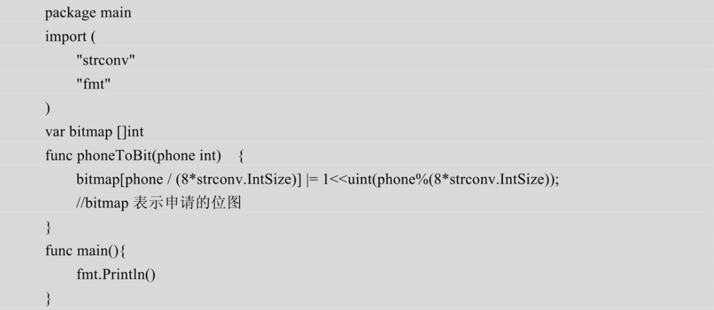

# 如何统计不同电话号码的个数

## 描述
已知某个文件内包含一些电话号码，每个号码为8位数字，统计不同号码的个数。

## 解答
这个题目从**本质上而言也是求解数据重复的问题**，一般而言，对于这类问题首先会考虑位图法。
对于本题而言，8位电话号码可以表示的范围为：00000000～9999 9999，
如果用1bit表示一个号码，总共需要1亿个bit，大约100MB的内存。

如何确定电话号码对应的是位图中的哪一位。下面重点介绍这个转化的方法，这里使用下面的对应方法。
00000000对应位图最后一位：0x0000…000001。
00000001对应位图倒数第二位：0x0000…0000010（1向左移一位）。
00000002对应位图倒数第三位：0x0000…0000100（1向左移2位）。
00000012对应位图的倒数十三位：0x0000…0001 0000 0000 0000。
通常，位图都是通过一个整数数组来实现的（这里假设一个整数占用4个字节）。
由此可以得出通过电话号码获取位图中对应位置的方法为（假设电话号码为P）：
1. 通过P/32就可以计算出该电话号码在bitmap数组的下标（因为每个整数占用32bit，通过这个公式就可以确定这个电话号码需要移动多少个32位，也就是可以确定它对应的bit在数组中的位置）。
2. 通过P%32就可以计算出这个电话号码在这个整型数字中具体的bit的位置，也就是1这个数字对应的左移次数。因此可以通过把1向左移P%32位，然后将得到的值与这个数组中的值做或运算，这样就能把这个电话号码在位图中对应的位设置为1。

   
## 参考
* Go程序员面试算法宝典

